# GWASサンプルSNP推定結果 解析レポート

## 📋 目次
- [解析の概要](#解析の概要)
- [データの読み込みと前処理](#データの読み込みと前処理)
- [品質管理：リードカウントによる選抜](#品質管理リードカウントによる選抜)
- [Genotype一致性の評価](#genotype一致性の評価)
- [プレートマップによる空間的分布](#プレートマップによる空間的分布)
- [圃場マップによる時空間分析](#圃場マップによる時空間分析)
- [クロス集計による詳細解析](#クロス集計による詳細解析)
- [KOB084系統の特殊事例](#kob084系統の特殊事例)
- [一度も一致しなかった系統](#一度も一致しなかった系統)
- [結論と推奨事項](#結論と推奨事項)

---

## 解析の概要

### 🎯 目的
RNA-seqデータから得られたSNP情報を用いて、GWASサンプル（2018-2020年の3年分）の系統（Genotype）を推定し、記録されている系統情報との一致性を検証する。

### 📊 データソース
- **対象期間**: 2018年、2019年、2020年の3年間
- **サンプル総数**: 3年分を統合
- **比較対象**: 記録上のGenotype vs SNPから推定したGenotype_panel

### 🔄 解析フロー
```
データ読み込み (2018-2020)
    ↓
SNP推定結果の統合
    ↓
KOB054サンプルの除外
    ↓
品質フィルタリング (total.rawcnt ≥ 10^5.5)
    ↓
一致性評価・可視化
    ↓
空間分析 (プレート・圃場)
    ↓
詳細クロス集計
```

---

## データの読み込みと前処理

### データ統合
- 3年分のAttributeデータ（`all.at.GWAS.2018/2019/2020`）を読み込み
- 各年のgenotype_match.tsvから最良マッチ（Discordance最小）を抽出
- Sample_Indexをキーにして統合

### KOB054の除外
**理由**: 特定の系統（KOB054）が多数のサンプルで誤推定される傾向が確認されたため、解析から除外

**除外対象**:
- 記録上のGenotype = "KOB054"
- 推定されたGenotype_panel = "KOB084"

---

## 品質管理：リードカウントによる選抜

### 選抜基準
**閾値**: `total.rawcnt ≥ 10^5.5` (約316,228 reads)

この閾値は、SNP推定の信頼性を担保するために設定された。

### 図1: Total Raw Count分布（一致 vs 不一致）

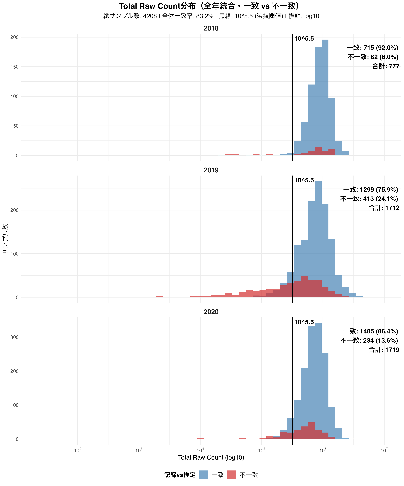

**主要な知見**:
- 📈 **横軸（log10スケール）**: Total Raw Count（総リード数）
- 🎨 **色分け**:
  - 🔵 青色: 記録と推定が一致したサンプル
  - 🔴 赤色: 記録と推定が不一致のサンプル
- ⚫ **黒い縦線**: 10^5.5の選抜閾値

**解釈**:
- リード数が少ないサンプル（10^5.5以下）では不一致率が高い傾向
- リード数が多いサンプルでは一致率が向上
- 10^5.5の閾値設定は妥当であることを示唆

---

## Genotype一致性の評価

### 年別一致性

#### 図2: 年別 Genotype記録とSNP推定の一致性

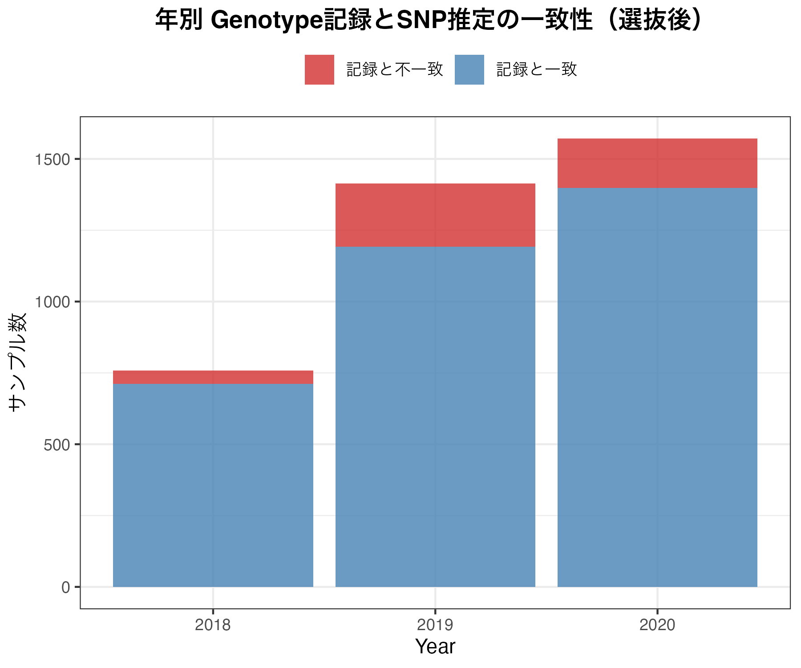

**内容**:
- 各年のサンプル数を一致/不一致で積み上げ棒グラフ表示
- 🔵 青色: 一致、🔴 赤色: 不一致

**解釈**:
- 各年での一致率の傾向を把握
- 年次間での品質のバラつきを評価
- 選抜後は一致率が改善

### PlateNo別一致性

#### 図3: PlateNo・年別 Genotype記録との一致率（ヒートマップ）

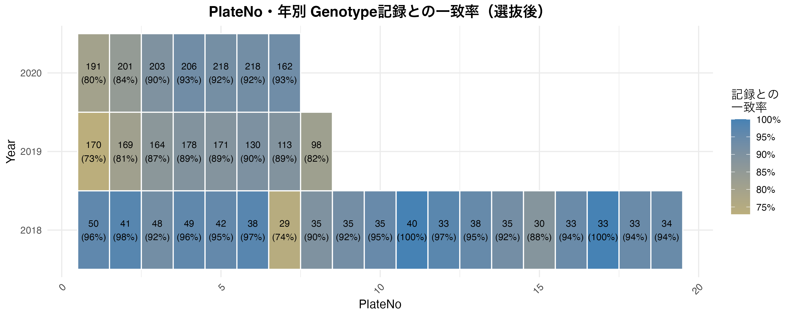

**内容**:
- **X軸**: PlateNo、**Y軸**: Year
- 各セルに一致サンプル数と一致率（%）を表示
- **色**: 🔴 赤（低一致率）→ 🟡 黄色 → 🔵 青（高一致率）

**解釈**:
- プレート間での品質のバラつきを可視化
- 特定のプレートで一致率が低い場合、そのプレートの処理に問題があった可能性
- 問題のあるプレートを特定し、原因究明に役立つ

#### 図4: PlateNo別 Genotype記録との一致性（年別ファセット）

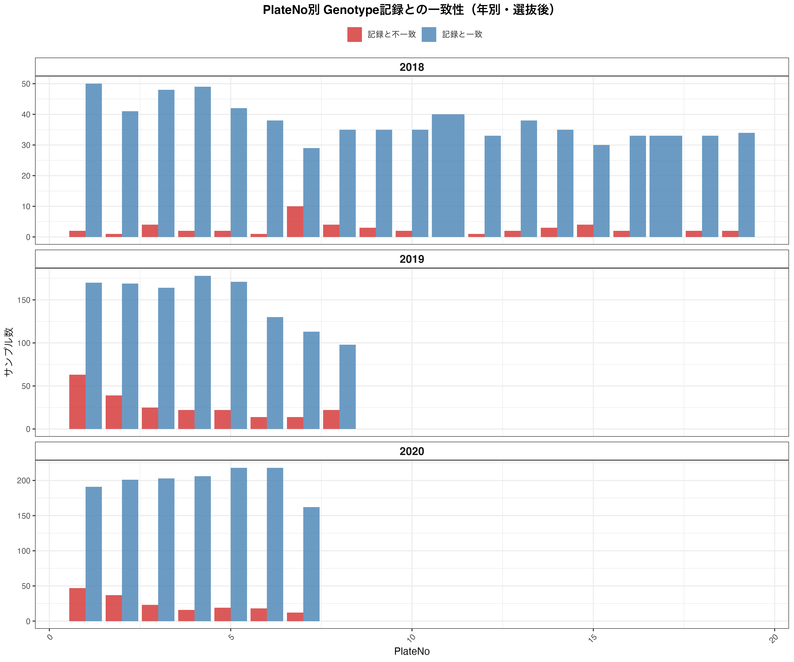

**内容**:
- 年別にファセット分割
- PlateNo別に一致/不一致のサンプル数を並列棒グラフで表示

**解釈**:
- より詳細なプレート別の傾向を把握
- 年ごとのプレート数や品質の違いを比較

### DiscordanceとSites_comparedの分布

#### 図5: 比較サイト数の分布

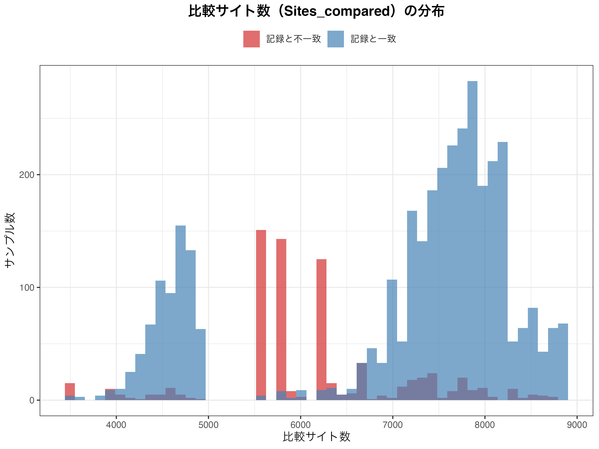

**解釈**:
- 比較サイト数が多いほど推定の信頼性が高い
- 不一致サンプルで比較サイト数が少ない場合、データ不足が原因の可能性

#### 図6: Discordance（不一致率）の分布

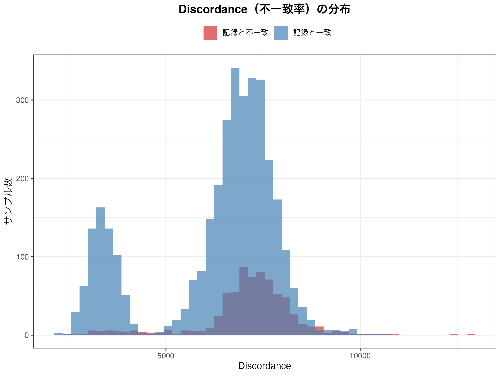

**解釈**:
- Discordanceが低い = 推定系統とのSNP一致度が高い
- 一致サンプルは低Discordance、不一致サンプルは高Discordanceを示す傾向

#### 図7: Discordance vs Sites_compared散布図

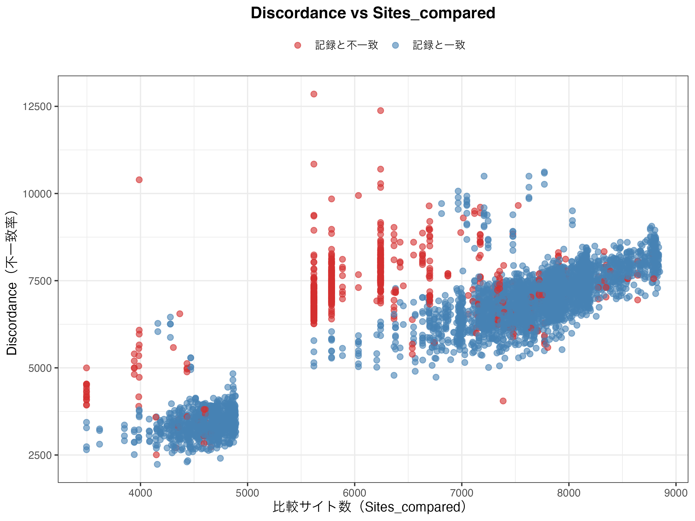

**解釈**:
- 比較サイト数とDiscordanceの関係を視覚化
- 理想的には、Sites_comparedが多く、Discordanceが低いサンプルが多いことが望ましい

---

## プレートマップによる空間的分布

### プレートマップの概要
96wellプレート形式でサンプルの一致/不一致状況を可視化。

### プレートマップの例

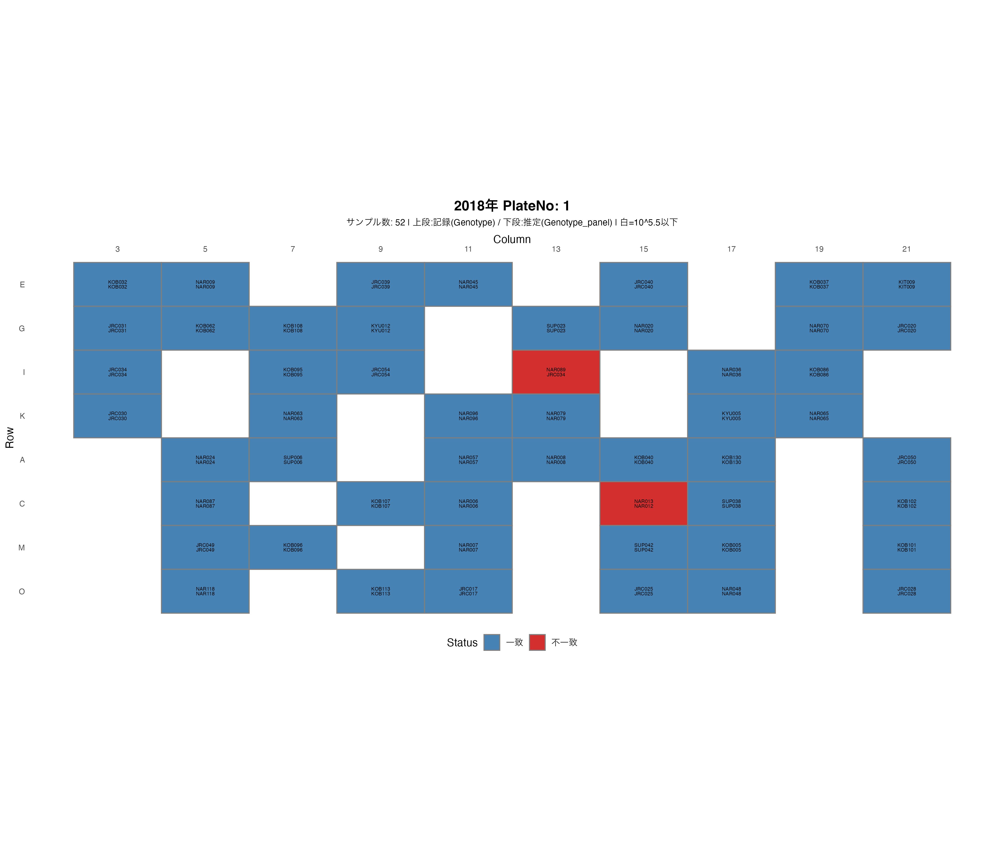

### マップの構成
- **行（Row）**: A-H（通常の96wellプレート）
- **列（Column）**: 1-12
- **各セルの表示内容**:
  - 上段: 記録上のGenotype
  - 下段: SNP推定のGenotype_panel
- **色分け**:
  - 🔵 青色: 一致
  - 🔴 赤色: 不一致
  - ⚪ 白色: 10^5.5以下（選抜前のみ）
  - ⚫ 灰色: SNPデータなし

### 活用方法
1. **コンタミネーション検出**: 隣接ウェル間での系統の混在パターンを確認
2. **プレート端効果**: プレートの端（A列、H列、1番、12番）での品質低下を確認
3. **ピペッティングエラー**: 特定のパターン（例: 列または行全体）での不一致

> 📁 全てのプレートマップは `results/plate_maps/` ディレクトリに保存されています

---

## 圃場マップによる時空間分析

### 圃場マップの原理
**座標の決定**: LineNameの後ろ3文字を圃場座標として使用
- 例: `LineName = "Koshihikari001"` → 圃場座標 = 1

### 代表推定系統の概念
各記録系統について、最も多く推定された系統を「代表推定系統」として計算。

**表示ロジック**:
1. 代表推定系統 = 記録系統 → 系統名のみ表示（🔵 青色）
2. 代表推定系統 ≠ 記録系統 → `{代表推定} <> {記録}` 形式で表示（🔴 赤色）
3. 常に一致する系統 → 系統名のみ表示（🔵 青色）

### 図8: 圃場マップ（2018年）

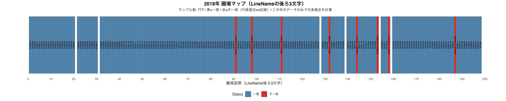

### 図9: 圃場マップ（全年統合）

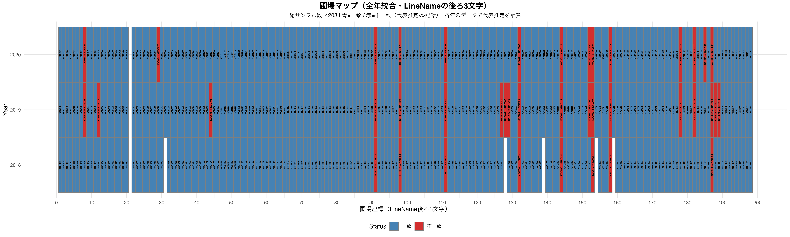

**解釈**:
- 圃場内での系統取り違えのパターンを空間的に把握
- 隣接する圃場位置での混入を検出
- サンプリング時のエラーを推定
- 年次間での圃場利用パターンの比較

> 📁 全ての圃場マップは `results/field_maps/` ディレクトリに保存されています

---

## クロス集計による詳細解析

### Genotypeクロス集計

#### 図10: Genotype記録 vs SNP推定ヒートマップ（全年統合）


**内容**:
- **X軸**: 記録上のGenotype
- **Y軸**: SNP推定のGenotype_panel
- **各セル**: サンプル数（log10スケール）
- **色**: 🔴 赤（対角線＝一致）、🔵 青（非対角線＝不一致）

**解釈**:
1. **対角線上（赤色）**: 記録と推定が一致
2. **対角線外（青色）**: 記録と推定が不一致
3. **濃い色**: サンプル数が多い組み合わせ
4. **パターン認識**: 
   - 特定の系統が別の系統に頻繁に誤推定される場合、その組み合わせのセルが濃くなる
   - 遺伝的に近い系統間での混同の可能性

### Genotypeクロス集計（不一致系統のみ）

#### 図11: Genotype記録 vs SNP推定（不一致系統のみ）


**内容**:
- 完全一致系統（記録と推定が常に100%一致する系統）を除外
- 問題のある系統のみに焦点を当てた解析

**解釈**:
- より詳細な不一致パターンの把握
- 対策が必要な系統の特定

### LineNameクロス集計

#### 図12: LineName記録 vs SNP推定ヒートマップ（全年統合）


**解釈**:
- 系統レベル（LineName）での一致性評価
- 複数のGenotypeが同じLineNameに対応する場合の集約効果

#### 図13: LineName記録 vs SNP推定（不一致系統のみ）


**解釈**:
- 完全一致系統を除外したLineName解析
- 品質選抜後の不一致パターンの変化を評価

> 📁 全てのクロス集計データは以下のディレクトリに保存されています：
> - `results/genotype_cross/`
> - `results/genotype_cross_filtered/`
> - `results/linename_cross/`
> - `results/linename_cross_filtered/`

---

## KOB084系統の特殊事例

### KOB084問題の発見
多数のサンプルが系統"KOB084"と誤推定される現象が確認された。

### 図14: Total Raw Count分布（KOB084推定 vs その他）


**内容**:
- 🟠 オレンジ色: KOB084と推定されたサンプル
- ⚫ 灰色: その他のサンプル
- 年別にファセット分割

**解釈**:
- KOB084と推定されたサンプルのリード数分布
- 低リード数サンプルでKOB084が誤推定されやすい可能性

### 図15: 不一致サンプルのみでのKOB084推定

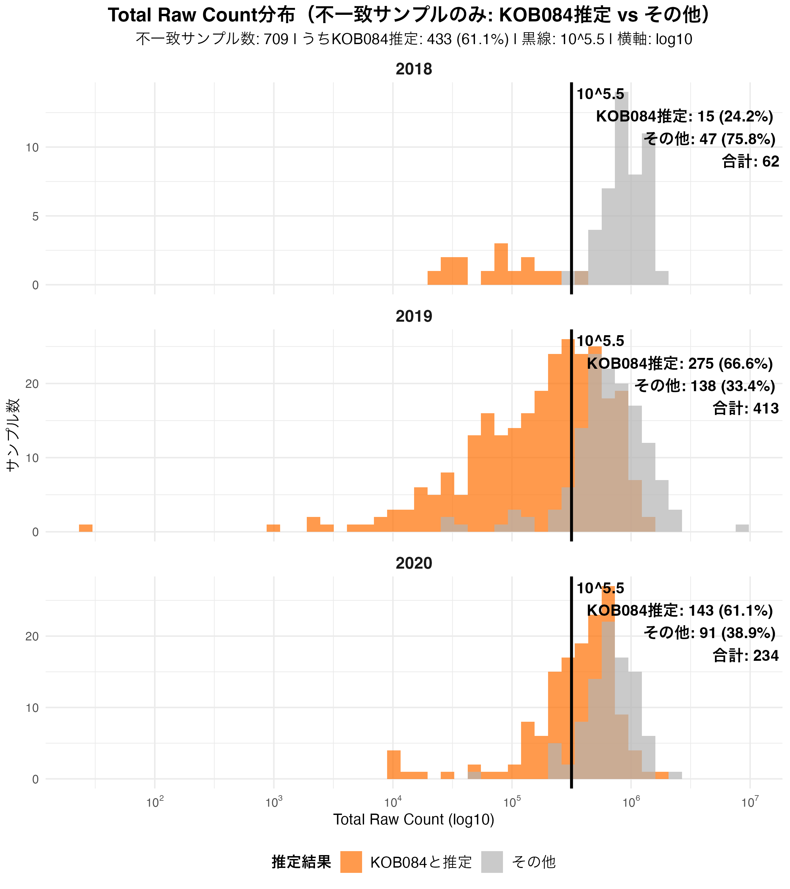

**内容**:
- 記録と推定が不一致のサンプルのみに限定
- その中でKOB084と推定されたサンプルの割合

**解釈**:
- 不一致の原因としてKOB084誤推定がどの程度寄与しているか
- KOB084除外の妥当性を評価

### KOB084の除外理由
上記の解析結果から、KOB084は信頼性の低い推定結果として扱い、解析から除外することが決定された。

---

## 一度も一致しなかった系統

### 問題系統の抽出
記録系統の中で、全サンプルで推定結果と一度も一致しなかった系統を特定。

📊 **詳細データ**: `results/never_matched_genotypes.csv`

### 想定される原因
1. **系統名の誤記**: 記録上の系統名が誤っている
2. **系統の取り違え**: サンプリング時に別の系統を採取
3. **参照パネルの問題**: SNP参照パネルにその系統が含まれていない
4. **ラベル貼り間違い**: サンプル管理時のヒューマンエラー

### 対応策
1. ✅ 元の記録を再確認
2. ✅ サンプリング手順の見直し
3. ✅ 参照パネルへの系統追加を検討
4. ✅ 該当サンプルの再サンプリング・再シーケンス

---

## 結論と推奨事項

### 🔍 主要な知見

#### 1. 品質管理の重要性
- **10^5.5（約316,000 reads）の閾値**: SNP推定の信頼性を担保するために効果的
- リード数が少ないサンプルでは不一致率が高く、品質選抜の必要性が明確

#### 2. 系統一致性
- ✅ 選抜後のデータでは一致率が向上
- ⚠️ ただし、選抜後も一定数の不一致が残存

#### 3. 空間的パターン
- プレートマップ・圃場マップにより、系統的なエラーパターンを検出可能
- 特定のプレートや圃場位置での問題を特定

#### 4. KOB084問題
- ⚠️ 特定の系統（KOB084）が頻繁に誤推定される
- 参照パネルの見直しまたは該当系統の除外が必要

#### 5. 完全不一致系統
- ⚠️ 一度も一致しなかった系統が存在
- 記録の正確性やサンプリング手順の見直しが必要

---

### 📋 推奨事項

#### 短期的対策（すぐに実施可能）
- [x] **品質フィルタリングの適用**: 10^5.5閾値を標準として採用
- [x] **KOB084の除外**: 信頼性の低い推定結果として扱う
- [ ] **不一致サンプルの精査**: 
  - プレートマップ・圃場マップから系統的エラーを特定
  - 原因究明と再サンプリング

#### 中期的対策（3-6ヶ月）
- [ ] **サンプリングプロトコルの改善**:
  - ダブルチェック体制の導入
  - バーコード管理の強化
- [ ] **参照パネルの見直し**:
  - 頻出系統の追加
  - 遺伝的に近い系統の識別性向上
- [ ] **プレート処理の標準化**:
  - プレート間のバラつきを減少させる手順の確立

#### 長期的対策（6ヶ月以上）
- [ ] **自動化の導入**: ヒューマンエラーを減らすための自動サンプリング・ラベリングシステム
- [ ] **リアルタイムQC**: シーケンス直後の品質チェックと即時フィードバック
- [ ] **統合データベース**: サンプル情報とシーケンス結果の一元管理

---

### 🎯 データの信頼性評価

#### 信頼性の高いデータ ✅
- `is.5.5 == TRUE`（10^5.5以上のリード数）
- 記録と推定が一致するサンプル
- Discordanceが低いサンプル

#### 注意が必要なデータ ⚠️
- リード数が閾値以下のサンプル
- KOB084と推定されたサンプル
- 一度も一致しなかった系統のサンプル
- 特定のプレートや圃場位置のサンプル

---

### 🔬 今後の解析への活用

この解析で得られた知見は、以下の研究に活用可能:
1. **GWAS解析**: 信頼性の高いサンプルのみを使用
2. **遺伝的多様性解析**: 系統同定精度の向上
3. **品質管理基準**: 他のプロジェクトへの応用
4. **サンプル追跡**: 問題のあるサンプルの原因究明

---

## 📁 主要な出力ファイル一覧

### 統合データ
- `results/all_samples_with_genotype_match.csv`: 全サンプルの統合データ（10^5.5選抜後）
- `results/uncrit/all_samples_with_genotype_match_uncrit.csv`: 全サンプルの統合データ（選抜前）

### サマリー
- `results/Genotype_match_summary_by_year_plateNo.csv`: 年・PlateNo別一致性サマリー
- `results/totalread_histogram/totalread_count_summary.csv`: リードカウントサマリー
- `results/never_matched_genotypes.csv`: 一度も一致しなかった系統リスト

### 詳細解析
- `results/genotype_cross/genotype_cross_table_{Year}.csv`: 年別Genotypeクロス集計
- `results/linename_cross/linename_cross_table_{Year}.csv`: 年別LineNameクロス集計
- `results/field_maps/field_map_data.csv`: 圃場マップデータ
- `results/kob084_histogram/kob084_estimated_samples.csv`: KOB084推定サンプル詳細

---

## 📖 用語集

| 用語 | 説明 |
|------|------|
| **Genotype** | 記録上の系統名 |
| **Genotype_panel** | SNPから推定された系統名 |
| **LineName** | 系統の別名（品種名など） |
| **Discordance** | SNP推定における不一致率（低いほど推定精度が高い） |
| **Sites_compared** | 比較したSNPサイト数（多いほど信頼性が高い） |
| **total.rawcnt** | 総リード数（RNA-seqの測定量） |
| **is.5.5** | total.rawcnt ≥ 10^5.5 のフラグ |
| **PlateNo** | 96wellプレートの番号 |
| **Position** | プレート内のウェル位置（例: A1, B3） |

---

## 🔗 関連リンク

- 解析スクリプト: `scripts/gwasID2SNPcall_results.R`
- 結果ディレクトリ: `results/`
- 入力データ: `data/opt/`

---

## 📝 改訂履歴
- 2025-11-XX: 初版作成
- GitHub公開用にフォーマット調整

---

<div align="center">

**🌾 Japonica GWAS Project 🌾**

解析に関する質問や改善提案がありましたら、Issueを作成してください。

</div>

